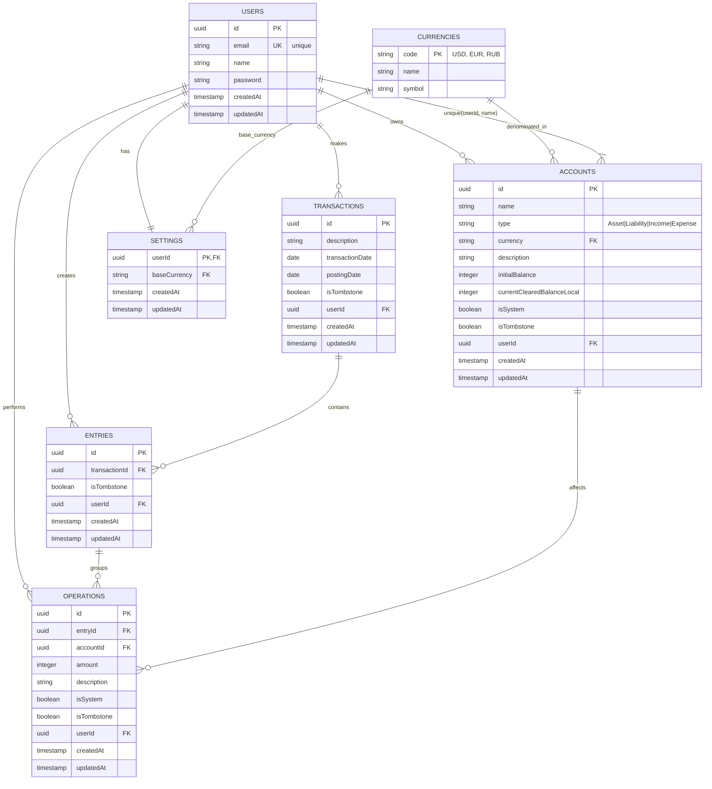

# 📊 Database Schema - Ledgerly

Database schema documentation for Ledgerly financial tracker.

## 🎯 Overview

Ledgerly uses SQLite with Drizzle ORM for personal finance management. The architecture is built on these principles:
- **User data isolation** - all data is tied to userId
- **Double-entry bookkeeping** - operations are grouped within entries and transactions
- **Multi-currency support** - different currencies with trading accounts
- **Cascade deletions** - data integrity
- **Soft deletes** - using `isTombstone` flag

## 📋 Entity Relationship Diagram



## 🏗️ Entities

### 🏦 **Users**
Base entity for authentication and authorization.

| Field | Type | Description | Constraints |
|------|-----|----------|-------------|
| `id` | UUID | Primary key | PK, NOT NULL |
| `email` | String | User email | UNIQUE, NOT NULL |
| `name` | String | User name | NOT NULL |
| `password` | String | Hashed password | NOT NULL |
| `createdAt` | Timestamp | Creation date | NOT NULL |
| `updatedAt` | Timestamp | Last update date | NOT NULL |

**Relations:**
- `1:N` with `accounts` (cascade delete)
- `1:N` with `transactions` (cascade delete)
- `1:N` with `entries` (cascade delete)
- `1:N` with `operations` (cascade delete)
- `1:1` with `settings`

---

### 💰 **Accounts**
User's financial accounts for tracking funds.

| Field | Type | Description | Constraints |
|------|-----|----------|-------------|
| `id` | UUID | Primary key | PK, NOT NULL |
| `name` | String | Account name | NOT NULL |
| `type` | Enum | Account type | `Asset\|Liability\|Income\|Expense` |
| `currency` | String | Account currency | NOT NULL (CurrencyCode) |
| `description` | String | Account description | NULLABLE |
| `initialBalance` | Integer | Initial balance (in cents) | NOT NULL, default: 0 |
| `currentClearedBalanceLocal` | Integer | Current balance (in cents) | NOT NULL, default: 0 |
| `isSystem` | Boolean | System account flag (for trading accounts) | NOT NULL, default: false |
| `isTombstone` | Boolean | Soft delete flag | NOT NULL, default: false |
| `userId` | UUID | Account owner | FK → `users.id` |
| `createdAt` | Timestamp | Creation date | NOT NULL |
| `updatedAt` | Timestamp | Last update date | NOT NULL |

**Constraints:**
- `UNIQUE(userId, name)` - unique name per user

**Relations:**
- `N:1` with `users`
- `1:N` with `operations`

**Notes:**
- Currency constraint to `currencies` table is removed for test performance
- Application-level validation should ensure valid currency codes
- Money amounts stored as integers (cents) to avoid floating-point issues
- System accounts (trading accounts) have `isSystem = true`

---

### 💱 **Currencies**
Dictionary of supported currencies.

| Field | Type | Description | Constraints |
|------|-----|----------|-------------|
| `code` | String | Currency code (ISO 4217) | PK, NOT NULL |
| `name` | String | Full name | NOT NULL |
| `symbol` | String | Currency symbol | NOT NULL |

**Examples:**
- `USD` - United States Dollar - `$`
- `EUR` - Euro - `€`
- `RUB` - Russian Ruble - `₽`

**Relations:**
- `1:N` with `accounts`
- `1:N` with `settings`

---

### 📝 **Transactions**
Top-level grouping of related financial events.

| Field | Type | Description | Constraints |
|------|-----|----------|-------------|
| `id` | UUID | Primary key | PK, NOT NULL |
| `description` | String | Transaction description | NOT NULL |
| `transactionDate` | Date | Transaction date | NOT NULL |
| `postingDate` | Date | Posting date | NOT NULL |
| `isTombstone` | Boolean | Soft delete flag | NOT NULL, default: false |
| `userId` | UUID | Transaction owner | FK → `users.id` |
| `createdAt` | Timestamp | Creation date | NOT NULL |
| `updatedAt` | Timestamp | Last update date | NOT NULL |

**Relations:**
- `N:1` with `users`
- `1:N` with `entries` (cascade delete)

**Indexes:**
- `idx_transactions_user_date` on `(userId, transactionDate)`

---

### 📦 **Entries**
Groups operations within a transaction to maintain per-currency balance.

| Field | Type | Description | Constraints |
|------|-----|----------|-------------|
| `id` | UUID | Primary key | PK, NOT NULL |
| `transactionId` | UUID | Parent transaction | FK → `transactions.id` |
| `isTombstone` | Boolean | Soft delete flag | NOT NULL, default: false |
| `userId` | UUID | Entry owner | FK → `users.id` |
| `createdAt` | Timestamp | Creation date | NOT NULL |
| `updatedAt` | Timestamp | Last update date | NOT NULL |

**Relations:**
- `N:1` with `transactions`
- `N:1` with `users`
- `1:N` with `operations` (cascade delete)

**Business Rules:**
- Each entry must contain at least 2 operations
- Sum of all operations within an entry must equal zero (per-currency balance)
- For multi-currency transactions, trading operations are added automatically

**Indexes:**
- `idx_entries_tx` on `transactionId`
- `idx_entries_user` on `userId`

---

### 🔄 **Operations**
Individual financial postings affecting accounts.

| Field | Type | Description | Constraints |
|------|-----|----------|-------------|
| `id` | UUID | Primary key | PK, NOT NULL |
| `entryId` | UUID | Parent entry | FK → `entries.id` |
| `accountId` | UUID | Affected account | FK → `accounts.id` |
| `amount` | Integer | Amount in account's currency (cents) | NOT NULL |
| `description` | String | Operation description | NULLABLE |
| `isSystem` | Boolean | System operation flag (for trading ops) | NOT NULL, default: false |
| `isTombstone` | Boolean | Soft delete flag | NOT NULL, default: false |
| `userId` | UUID | Operation owner | FK → `users.id` |
| `createdAt` | Timestamp | Creation date | NOT NULL |
| `updatedAt` | Timestamp | Last update date | NOT NULL |

**Relations:**
- `N:1` with `entries`
- `N:1` with `accounts` (restrict delete)
- `N:1` with `users`

**Business Rules:**
- Amount is always in the account's currency
- Positive amount = debit (increases Asset/Expense, decreases Liability/Income)
- Negative amount = credit (decreases Asset/Expense, increases Liability/Income)
- System operations (trading operations) have `isSystem = true`

**Indexes:**
- `idx_operations_entry` on `entryId`
- `idx_operations_account` on `accountId`
- `idx_operations_user` on `userId`

---

### ⚙️ **Settings**
User application settings.

| Field | Type | Description | Constraints |
|------|-----|----------|-------------|
| `userId` | UUID | User | PK, FK → `users.id` |
| `baseCurrency` | String | Base currency for reporting | FK → `currencies.code`, default: 'RUB' |
| `createdAt` | Timestamp | Creation date | NOT NULL |
| `updatedAt` | Timestamp | Last update date | NOT NULL |

**Relations:**
- `1:1` with `users`
- `N:1` with `currencies`

---

## 🔗 Relationships

### Data Hierarchy
```
USERS (root entity)
├── ACCOUNTS (financial accounts)
├── TRANSACTIONS (financial events)
│   └── ENTRIES (operation groupings)
│       └── OPERATIONS (individual postings)
└── SETTINGS (user preferences)
```

### Entity Relations
- **Users ↔ Accounts**: `1:N` with cascade delete
- **Users ↔ Transactions**: `1:N` with cascade delete
- **Users ↔ Entries**: `1:N` with cascade delete
- **Users ↔ Operations**: `1:N` with cascade delete
- **Users ↔ Settings**: `1:1`
- **Transactions ↔ Entries**: `1:N` with cascade delete
- **Entries ↔ Operations**: `1:N` with cascade delete
- **Accounts ↔ Operations**: `1:N` (restrict delete)
- **Currencies ↔ Accounts**: `1:N`
- **Currencies ↔ Settings**: `1:N`

---

## 💡 Business Rules

### Uniqueness
1. **User email** must be unique system-wide
2. **Account name** must be unique per user

### Data Integrity
1. **Cascade deletions**: When a user is deleted, all their data is deleted
2. **Required relations**: Each operation must have an entry and account
3. **Currency constraints**: All accounts reference existing currencies (application-level)
4. **Soft deletes**: Entities use `isTombstone` flag instead of hard deletes

### Accounting Principles
1. **Double-entry bookkeeping**: Operations are grouped in entries to ensure balance
2. **Per-currency balancing**: Each entry must balance to zero in its currency
3. **Multi-currency support**: Handled through trading accounts and entries
4. **Immutable operations**: Operations cannot be edited, only recreated

---

## 🚀 Schema Files

Schemas are defined in the following files:
- `apps/backend/src/db/schemas/users.ts` - Users
- `apps/backend/src/db/schemas/accounts.ts` - Accounts
- `apps/backend/src/db/schemas/currencies.ts` - Currencies
- `apps/backend/src/db/schemas/transactions.ts` - Transactions
- `apps/backend/src/db/schemas/entries.ts` - Entries
- `apps/backend/src/db/schemas/operations.ts` - Operations
- `apps/backend/src/db/schemas/settings.ts` - Settings

All schemas are exported through `apps/backend/src/db/schema.ts`.

---

*Last updated: December 3, 2025*
