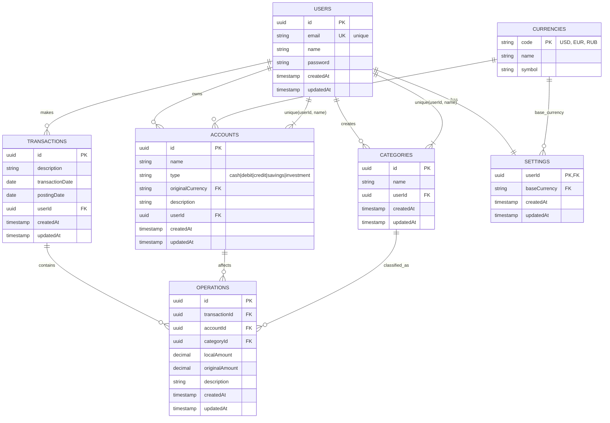

# 📊 Database Schema - Ledgerly

Документация по схеме базы данных финансового трекера Ledgerly.

## 🎯 Общий обзор

Ledgerly использует SQLite с Drizzle ORM для управления персональными финансами. Архитектура построена на принципах:
- **Изоляция данных по пользователям** - все данные привязаны к userId
- **Двойная запись** - операции группируются в транзакции
- **Мультивалютность** - поддержка разных валют
- **Каскадные удаления** - целостность данных

## 📋 Entity Relationship Diagram



## 🏗️ Сущности

### 🏦 **Users** - Пользователи
Базовая сущность для аутентификации и авторизации.

| Поле | Тип | Описание | Ограничения |
|------|-----|----------|-------------|
| `id` | UUID | Первичный ключ | PK, NOT NULL |
| `email` | String | Email пользователя | UNIQUE, NOT NULL |
| `name` | String | Имя пользователя | NOT NULL |
| `password` | String | Хешированный пароль | NOT NULL |
| `createdAt` | Timestamp | Дата создания | NOT NULL |
| `updatedAt` | Timestamp | Дата изменения | NOT NULL |

**Связи:**
- `1:N` с `accounts` (каскадное удаление)
- `1:N` с `categories` (каскадное удаление)
- `1:N` с `transactions` (каскадное удаление)
- `1:1` с `settings`

---

### 💰 **Accounts** - Счета
Финансовые счета пользователя для учета средств.

| Поле | Тип | Описание | Ограничения |
|------|-----|----------|-------------|
| `id` | UUID | Первичный ключ | PK, NOT NULL |
| `name` | String | Название счета | NOT NULL |
| `type` | Enum | Тип счета | `cash|debit|credit|savings|investment` |
| `originalCurrency` | String | Валюта счета | FK → `currencies.code` |
| `description` | String | Описание счета | NULLABLE |
| `userId` | UUID | Владелец счета | FK → `users.id` |
| `createdAt` | Timestamp | Дата создания | NOT NULL |
| `updatedAt` | Timestamp | Дата изменения | NOT NULL |

**Ограничения:**
- `UNIQUE(userId, name)` - уникальность названия в рамках пользователя

**Связи:**
- `N:1` с `users`
- `N:1` с `currencies`
- `1:N` с `operations`

---

### 📊 **Categories** - Категории
Категории для классификации финансовых операций.

| Поле | Тип | Описание | Ограничения |
|------|-----|----------|-------------|
| `id` | UUID | Первичный ключ | PK, NOT NULL |
| `name` | String | Название категории | NOT NULL |
| `userId` | UUID | Владелец категории | FK → `users.id` |
| `createdAt` | Timestamp | Дата создания | NOT NULL |
| `updatedAt` | Timestamp | Дата изменения | NOT NULL |

**Ограничения:**
- `UNIQUE(userId, name)` - уникальность названия в рамках пользователя

**Связи:**
- `N:1` с `users`
- `1:N` с `operations`

---

### 💱 **Currencies** - Валюты
Справочник поддерживаемых валют.

| Поле | Тип | Описание | Ограничения |
|------|-----|----------|-------------|
| `code` | String | Код валюты (ISO 4217) | PK, NOT NULL |
| `name` | String | Полное название | NOT NULL |
| `symbol` | String | Символ валюты | NOT NULL |

**Примеры:**
- `USD` - United States Dollar - `$`
- `EUR` - Euro - `€`
- `RUB` - Russian Ruble - `₽`

**Связи:**
- `1:N` с `accounts`
- `1:N` с `settings`

---

### 📝 **Transactions** - Транзакции
Группировка связанных финансовых операций.

| Поле | Тип | Описание | Ограничения |
|------|-----|----------|-------------|
| `id` | UUID | Первичный ключ | PK, NOT NULL |
| `description` | String | Описание транзакции | NOT NULL |
| `transactionDate` | Date | Дата совершения | NOT NULL |
| `postingDate` | Date | Дата проводки | NOT NULL |
| `userId` | UUID | Владелец транзакции | FK → `users.id` |
| `createdAt` | Timestamp | Дата создания | NOT NULL |
| `updatedAt` | Timestamp | Дата изменения | NOT NULL |

**Связи:**
- `N:1` с `users`
- `1:N` с `operations` (каскадное удаление)

---

### 🔄 **Operations** - Операции
Отдельные финансовые записи в рамках транзакции.

| Поле | Тип | Описание | Ограничения |
|------|-----|----------|-------------|
| `id` | UUID | Первичный ключ | PK, NOT NULL |
| `transactionId` | UUID | Родительская транзакция | FK → `transactions.id` |
| `accountId` | UUID | Затрагиваемый счет | FK → `accounts.id` |
| `categoryId` | UUID | Категория операции | FK → `categories.id` |
| `localAmount` | Decimal | Сумма в валюте счета | NOT NULL |
| `originalAmount` | Decimal | Оригинальная сумма | NOT NULL |
| `description` | String | Описание операции | NULLABLE |
| `createdAt` | Timestamp | Дата создания | NOT NULL |
| `updatedAt` | Timestamp | Дата изменения | NOT NULL |

**Связи:**
- `N:1` с `transactions`
- `N:1` с `accounts`
- `N:1` с `categories`

---

### ⚙️ **Settings** - Настройки
Пользовательские настройки приложения.

| Поле | Тип | Описание | Ограничения |
|------|-----|----------|-------------|
| `userId` | UUID | Пользователь | PK, FK → `users.id` |
| `baseCurrency` | String | Базовая валюта | FK → `currencies.code` |
| `createdAt` | Timestamp | Дата создания | NOT NULL |
| `updatedAt` | Timestamp | Дата изменения | NOT NULL |

**Связи:**
- `1:1` с `users`
- `N:1` с `currencies`

## 🔗 Типы связей

### Иерархия данных
```
USERS (корневая сущность)
├── ACCOUNTS (финансовые счета)
├── CATEGORIES (категории операций)
├── TRANSACTIONS (группы операций)
│   └── OPERATIONS (отдельные проводки)
└── SETTINGS (пользовательские настройки)
```

### Связи между сущностями
- **Users ↔ Accounts**: `1:N` с каскадным удалением
- **Users ↔ Categories**: `1:N` с каскадным удалением  
- **Users ↔ Transactions**: `1:N` с каскадным удалением
- **Users ↔ Settings**: `1:1`
- **Transactions ↔ Operations**: `1:N` с каскадным удалением
- **Accounts ↔ Operations**: `1:N`
- **Categories ↔ Operations**: `1:N`
- **Currencies ↔ Accounts**: `1:N`
- **Currencies ↔ Settings**: `1:N`

## 💡 Бизнес-правила

### Уникальность
1. **Email пользователя** должен быть уникальным в системе
2. **Название счета** должно быть уникальным в рамках пользователя
3. **Название категории** должно быть уникальным в рамках пользователя

### Целостность данных
1. **Каскадные удаления**: При удалении пользователя удаляются все его данные
2. **Обязательные связи**: Каждая операция должна иметь счет, категорию и транзакцию
3. **Валютные ограничения**: Все счета и настройки ссылаются на существующие валюты

### Принципы учета
1. **Двойная запись**: Операции группируются в транзакции для обеспечения баланса
2. **Мультивалютность**: Поддержка операций в разных валютах
3. **Временные метки**: Различие между датой операции и датой проводки

## 🚀 Примеры использования

### Создание простой транзакции
```typescript
// 1. Создать транзакцию
const transaction = await db.insert(transactions).values({
  id: generateId(),
  description: "Покупка продуктов",
  transactionDate: new Date(),
  postingDate: new Date(),
  userId: user.id
});

// 2. Создать операцию расхода
const operation = await db.insert(operations).values({
  id: generateId(),
  transactionId: transaction.id,
  accountId: cashAccount.id,
  categoryId: foodCategory.id,
  localAmount: -500.00,
  originalAmount: -500.00,
  description: "Магазин 'Пятерочка'"
});
```

### Перевод между счетами
```typescript
// Транзакция перевода между счетами
const transferTransaction = await db.insert(transactions).values({
  description: "Перевод с карты на наличные",
  transactionDate: new Date(),
  postingDate: new Date(),
  userId: user.id
});

// Операция списания с карты
await db.insert(operations).values({
  transactionId: transferTransaction.id,
  accountId: cardAccount.id,
  categoryId: transferCategory.id,
  localAmount: -1000.00,
  originalAmount: -1000.00
});

// Операция пополнения наличных
await db.insert(operations).values({
  transactionId: transferTransaction.id,
  accountId: cashAccount.id,
  categoryId: transferCategory.id,
  localAmount: 1000.00,
  originalAmount: 1000.00
});
```

## 📁 Файлы схем

Схемы определены в следующих файлах:
- `src/db/schemas/users.ts` - Пользователи
- `src/db/schemas/accounts.ts` - Счета
- `src/db/schemas/categories.ts` - Категории
- `src/db/schemas/currencies.ts` - Валюты
- `src/db/schemas/transactions.ts` - Транзакции
- `src/db/schemas/operations.ts` - Операции
- `src/db/schemas/settings.ts` - Настройки

Все схемы экспортируются через `src/db/schema.ts`.

---

*Последнее обновление: July 23, 2025*
