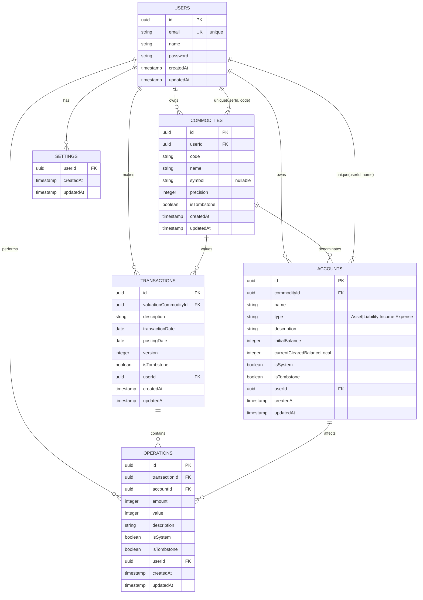

# Database Schema - Ledgerly

Database schema documentation for Ledgerly financial tracker.

## Overview

Ledgerly uses SQLite with Drizzle ORM for personal finance management. The
architecture is built on these principles:

- **User data isolation** - all user-owned data is tied to `userId`.
- **Double-entry bookkeeping** - operations belong directly to transactions.
- **Commodity-based accounting** - accounts and transactions reference
  user-owned Commodities by stable id.
- **Cascade deletions** - user-owned data is removed with the user where the
  schema defines cascading relations.
- **Soft deletes** - domain records use an `isTombstone` flag where deletion
  must remain observable.

## Entity Relationship Diagram


```mermaid
erDiagram
    USERS {
        uuid id PK
        string email UK "unique"
        string name
        string password
        timestamp createdAt
        timestamp updatedAt
    }

    COMMODITIES {
        uuid id PK
        uuid userId FK
        string code
        string name
        string symbol "nullable"
        integer precision
        boolean isTombstone
        timestamp createdAt
        timestamp updatedAt
    }

    ACCOUNTS {
        uuid id PK
        uuid commodityId FK
        string name
        string type "Asset|Liability|Income|Expense"
        string description
        integer initialBalance
        integer currentClearedBalanceLocal
        boolean isSystem
        boolean isTombstone
        uuid userId FK
        timestamp createdAt
        timestamp updatedAt
    }

    TRANSACTIONS {
        uuid id PK
        uuid valuationCommodityId FK
        string description
        date transactionDate
        date postingDate
        integer version
        boolean isTombstone
        uuid userId FK
        timestamp createdAt
        timestamp updatedAt
    }

    OPERATIONS {
        uuid id PK
        uuid transactionId FK
        uuid accountId FK
        integer amount
        integer value
        string description
        boolean isSystem
        boolean isTombstone
        uuid userId FK
        timestamp createdAt
        timestamp updatedAt
    }

    SETTINGS {
        uuid userId FK
        timestamp createdAt
        timestamp updatedAt
    }

    USERS ||--o{ COMMODITIES : "owns"
    USERS ||--o{ ACCOUNTS : "owns"
    USERS ||--o{ TRANSACTIONS : "makes"
    USERS ||--o{ OPERATIONS : "performs"
    USERS ||--o{ SETTINGS : "has"

    COMMODITIES ||--o{ ACCOUNTS : "denominates"
    COMMODITIES ||--o{ TRANSACTIONS : "values"

    TRANSACTIONS ||--o{ OPERATIONS : "contains"
    ACCOUNTS ||--o{ OPERATIONS : "affects"

    COMMODITIES }|--|| USERS : "unique(userId, code)"
    ACCOUNTS }|--|| USERS : "unique(userId, name)"
```

## Entities

### Users

Base entity for authentication and authorization.

| Field | Type | Description | Constraints |
|------|-----|----------|-------------|
| `id` | UUID | Primary key | PK, NOT NULL |
| `email` | String | User email | UNIQUE, NOT NULL |
| `name` | String | User name | NOT NULL |
| `password` | String | Hashed password | NOT NULL |
| `createdAt` | Timestamp | Creation date | NOT NULL |
| `updatedAt` | Timestamp | Last update date | NOT NULL |

**Relations:**

- `1:N` with `commodities` (cascade delete)
- `1:N` with `accounts` (cascade delete)
- `1:N` with `transactions` (cascade delete)
- `1:N` with `operations` (cascade delete)
- `1:N` with `settings`

---

### Commodities

User-owned monetary units used by accounts and transactions.

| Field | Type | Description | Constraints |
|------|-----|----------|-------------|
| `id` | UUID | Stable Commodity identity | PK, NOT NULL |
| `userId` | UUID | Commodity owner | FK -> `users.id`, NOT NULL, ON DELETE CASCADE |
| `code` | String | User-visible display/search code | NOT NULL, unique per user |
| `name` | String | Display name | NOT NULL |
| `symbol` | String | Optional display symbol | NULLABLE |
| `precision` | Integer | Minor-unit scale for integer amounts | NOT NULL, immutable after creation |
| `isTombstone` | Boolean | Technical soft delete flag | NOT NULL, default: false |
| `createdAt` | Timestamp | Creation date | NOT NULL |
| `updatedAt` | Timestamp | Last update date | NOT NULL |

**Constraints:**

- `UNIQUE(userId, code)` through `commodities_user_id_code_unique_idx`.

**Relations:**

- `N:1` with `users`
- `1:N` with `accounts`
- `1:N` with `transactions`

**Notes:**

- Commodity identity is `id`, not `code`.
- Predefined currencies such as `USD`, `EUR`, and `RUB` are ordinary per-user
  Commodity records when created.
- The MVP does not include global Commodity records, `ReferenceAsset`, market
  rates, provider metadata, automatic conversion, or Commodity archiving.

---

### Accounts

User's financial accounts for tracking funds.

| Field | Type | Description | Constraints |
|------|-----|----------|-------------|
| `id` | UUID | Primary key | PK, NOT NULL |
| `commodityId` | UUID | Account Commodity | FK -> `commodities.id`, NOT NULL |
| `name` | String | Account name | NOT NULL |
| `type` | Enum | Account type | `Asset\|Liability\|Income\|Expense` |
| `description` | String | Account description | NOT NULL |
| `initialBalance` | Integer | Initial balance in minor units | NOT NULL, default: 0 |
| `currentClearedBalanceLocal` | Integer | Current local balance in minor units | NOT NULL, default: 0 |
| `isSystem` | Boolean | Reserved system account flag | NOT NULL, default: false |
| `isTombstone` | Boolean | Soft delete flag | NOT NULL, default: false |
| `userId` | UUID | Account owner | FK -> `users.id`, NOT NULL, ON DELETE CASCADE |
| `createdAt` | Timestamp | Creation date | NOT NULL |
| `updatedAt` | Timestamp | Last update date | NOT NULL |

**Constraints:**

- `UNIQUE(userId, name)` through `user_id_name_unique_idx`.

**Relations:**

- `N:1` with `users`
- `N:1` with `commodities`
- `1:N` with `operations`

**Notes:**

- Account Commodity is immutable after account creation.
- Money amounts are stored as integer minor units to avoid floating-point
  issues.
- System accounts are reserved for future trading-account support.

---

### Transactions

Top-level grouping of related financial events.

| Field | Type | Description | Constraints |
|------|-----|----------|-------------|
| `id` | UUID | Primary key | PK, NOT NULL |
| `valuationCommodityId` | UUID | Commodity that denominates operation `value` fields | FK -> `commodities.id`, NOT NULL |
| `description` | String | Transaction description | NOT NULL |
| `transactionDate` | Date | Transaction date | NOT NULL |
| `postingDate` | Date | Posting date | NOT NULL |
| `version` | Integer | Optimistic concurrency version | NOT NULL, default: 0 |
| `isTombstone` | Boolean | Soft delete flag | NOT NULL, default: false |
| `userId` | UUID | Transaction owner | FK -> `users.id`, NOT NULL, ON DELETE CASCADE |
| `createdAt` | Timestamp | Creation date | NOT NULL |
| `updatedAt` | Timestamp | Last update date | NOT NULL |

**Relations:**

- `N:1` with `users`
- `N:1` with `commodities`
- `1:N` with `operations` (cascade delete)

**Indexes:**

- `idx_transactions_user_date` on `(userId, transactionDate)`.

**Notes:**

- `valuationCommodityId` determines the denomination of operation `value`.
- `version` supports optimistic concurrency control and increments on aggregate
  updates.

---

### Operations

Individual financial postings affecting accounts.

| Field | Type | Description | Constraints |
|------|-----|----------|-------------|
| `id` | UUID | Primary key | PK, NOT NULL |
| `transactionId` | UUID | Parent transaction | FK -> `transactions.id`, NOT NULL, ON DELETE CASCADE |
| `accountId` | UUID | Affected account | FK -> `accounts.id`, NOT NULL, ON DELETE RESTRICT |
| `amount` | Integer | Amount in the account's Commodity minor units | NOT NULL |
| `value` | Integer | Amount in the transaction valuation Commodity minor units | NOT NULL |
| `description` | String | Operation description | NOT NULL |
| `isSystem` | Boolean | Reserved system operation flag | NOT NULL, default: false |
| `isTombstone` | Boolean | Soft delete flag | NOT NULL, default: false |
| `userId` | UUID | Operation owner | FK -> `users.id`, NOT NULL, ON DELETE CASCADE |
| `createdAt` | Timestamp | Creation date | NOT NULL |
| `updatedAt` | Timestamp | Last update date | NOT NULL |

**Relations:**

- `N:1` with `transactions`
- `N:1` with `accounts`
- `N:1` with `users`

**Business Rules:**

- `amount` is denominated by the operation account's Commodity.
- `value` is denominated by the parent transaction's valuation Commodity.
- Balance check: `sum(value)` across active operations in a transaction must
  equal 0.
- System operations are reserved for future trading-account support.

**Indexes:**

- `idx_operations_transaction` on `transactionId`.
- `idx_operations_account` on `accountId`.
- `idx_operations_user` on `userId`.

---

### Settings

User application settings.

| Field | Type | Description | Constraints |
|------|-----|----------|-------------|
| `userId` | UUID | User | FK -> `users.id`, NOT NULL |
| `createdAt` | Timestamp | Creation date | NOT NULL |
| `updatedAt` | Timestamp | Last update date | NOT NULL |

**Relations:**

- `N:1` with `users`

**Notes:**

- Settings do not currently store a base reporting Commodity.

---

## Relationships

### Data Hierarchy

```text
USERS (root entity)
|- COMMODITIES (user-owned monetary units)
|- ACCOUNTS (financial accounts)
|- TRANSACTIONS (financial events)
|  `- OPERATIONS (individual postings)
`- SETTINGS (user preferences)
```

### Entity Relations

- **Users <-> Commodities**: `1:N` with cascade delete.
- **Users <-> Accounts**: `1:N` with cascade delete.
- **Users <-> Transactions**: `1:N` with cascade delete.
- **Users <-> Operations**: `1:N` with cascade delete.
- **Users <-> Settings**: `1:N`.
- **Commodities <-> Accounts**: `1:N`.
- **Commodities <-> Transactions**: `1:N`.
- **Transactions <-> Operations**: `1:N` with cascade delete.
- **Accounts <-> Operations**: `1:N` with restrict delete.

---

## Business Rules

### Uniqueness

1. **User email** must be unique system-wide.
2. **Commodity code** must be unique per user.
3. **Account name** must be unique per user.

### Data Integrity

1. **User ownership**: accounts and transactions may reference only Commodities
   owned by the same user.
2. **Required relations**: each operation must have a transaction and account.
3. **Soft deletes**: entities use `isTombstone` where the deletion must be
   retained in storage.
4. **Commodity precision**: `precision` is immutable after Commodity creation.

### Accounting Principles

1. **Double-entry bookkeeping**: `sum(value)` across active operations in a
   transaction must equal 0.
2. **Commodity denomination**: `amount` is in account Commodity units; `value`
   is in transaction valuation Commodity units.
3. **Immutable operations**: operations cannot be edited, only recreated on
   transaction updates.

---

## Schema Files

Schemas are defined in the following files:

- `apps/backend/src/db/schemas/users.ts` - Users
- `apps/backend/src/db/schemas/commodities.ts` - Commodities
- `apps/backend/src/db/schemas/accounts.ts` - Accounts
- `apps/backend/src/db/schemas/transactions.ts` - Transactions
- `apps/backend/src/db/schemas/operations.ts` - Operations
- `apps/backend/src/db/schemas/settings.ts` - Settings

All schemas are exported through `apps/backend/src/db/schema.ts`.

---

*Last updated: July 23, 2026*
