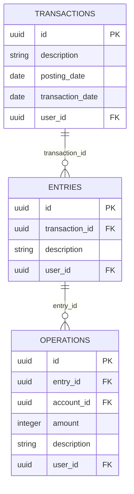

# Domain Model vs Database Schema Comparison

## Domain Model (In-Memory)
```mermaid
classDiagram
    class Transaction {
        -identity: EntityIdentity
        -entries: Entry[]
        +addEntry(entry: Entry)
        +removeEntry(entryId: Id)
        +getEntries(): readonly Entry[]
        +isBalanced(): boolean
    }
    
    class Entry {
        -identity: EntityIdentity
        -transactionRelation: ParentChildRelation
        +belongsToTransaction(transactionId: Id)
        +getTransactionId(): Id
    }
    
    class Operation {
        -entryId: Id
        -accountId: Id
        -amount: Amount
    }
    
    Transaction ||--o{ Entry : "contains (aggregate root)"
    Entry ||--o{ Operation : "contains"
```

## Database Schema (Persistent)


## Key Differences

| Aspect | Domain Model | Database Schema |
|--------|--------------|-----------------|
| **Relationship** | Transaction contains entries array | Entries reference transaction via FK |
| **Navigation** | `transaction.getEntries()` | `SELECT * FROM entries WHERE transaction_id = ?` |
| **Integrity** | Business logic validation | Foreign key constraints |
| **Lifecycle** | Aggregate root controls all | Independent table operations |
| **Performance** | In-memory access | Requires JOINs for full data |

## Why This Separation Works

1. **Domain Focus**: Domain model focuses on business rules and behavior
2. **Storage Optimization**: Database focuses on normalization and performance
3. **Flexibility**: Can change one without affecting the other
4. **Best Practices**: Each layer follows its own best practices

## Implementation Pattern

```typescript
// Domain Model - Transaction as Aggregate Root
class Transaction {
  private entries: Entry[] = [];
  
  addEntry(entry: Entry): void {
    // Business validation
    this.entries.push(entry);
  }
}

// Repository - Handles DB mapping
class TransactionRepository {
  async save(transaction: Transaction): Promise<void> {
    // Save transaction table
    await this.saveTransactionData(transaction);
    
    // Save related entries
    for (const entry of transaction.getEntries()) {
      await this.saveEntryData(entry);
    }
  }
  
  async findById(id: Id): Promise<Transaction> {
    // Load from normalized tables
    const txData = await this.loadTransaction(id);
    const entriesData = await this.loadEntriesByTransactionId(id);
    
    // Reconstruct aggregate
    const transaction = Transaction.restore(txData);
    for (const entryData of entriesData) {
      const entry = Entry.restore(entryData);
      transaction.addEntry(entry);
    }
    
    return transaction;
  }
}
```